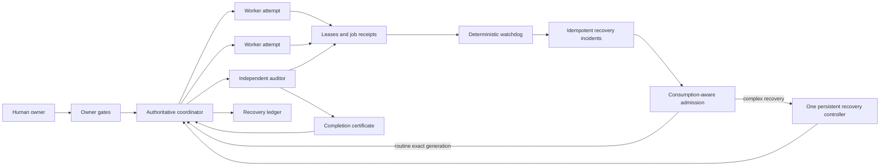

# Craft Agents Multi-Agent Orchestration Protocol v3.4.17 — Complete Standalone Guide

[](https://github.com/razumv/craft-protocol/actions/workflows/test.yml)
[](LICENSE)
[](CONTRIBUTING.md)

**Snapshot:** 2026-08-12 23:07 Europe/Warsaw
**Audience:** operators and contributors building safer coordinator/worker/auditor control planes with Craft Agents.
**Purpose:** deliver owner-requested product outcomes through autonomous project coordinators while preserving work, preventing split-brain, detecting stalls deterministically, gating irreversible actions, and using evidence as bounded acceptance rather than work for its own sake.

> This repository is self-contained: it includes the guide, executable scripts, launchd configuration, canonical skills/prompts, labels configuration, regression tests, and SHA-256 manifest. It contains no API keys, credentials, project repositories, private runtime receipts, or session transcripts.

Craft Protocol is open source under the [Apache License 2.0](LICENSE). Contributions are welcome. Start with [CONTRIBUTING.md](CONTRIBUTING.md), discuss broad designs in [GitHub Discussions](https://github.com/razumv/craft-protocol/discussions), and follow [GOVERNANCE.md](GOVERNANCE.md) and [CODE_OF_CONDUCT.md](CODE_OF_CONDUCT.md). See [SUPPORT.md](SUPPORT.md) for help channels and report vulnerabilities privately according to [SECURITY.md](SECURITY.md).

### Quick start

```bash
git clone https://github.com/razumv/craft-protocol.git
cd craft-protocol
./install.sh          # dry-run; no files changed
```

Install/start a separately reviewed capability-v2 Craft runtime first. The v3.3.0 production-tested identity is `0.11.4-admission.87951ae` / `87951ae640df64d00534a54dce9b5e8b5922d27c` (including queue-only busy coordinator and recovery-controller delivery), then review the Protocol plan and use `./install.sh --apply`. The Protocol installer restores the kill switch before its first payload copy. Merge `config/labels.config.json` manually rather than replacing an existing label configuration. Self-healing scheduler automations ship permanently disabled. Protocol v3.2.2 requires authenticated admission capability v2 with exact runtime version/commit pinning, durable delivery inspection, and one guarded recovery CAS. Outstanding messages are coalesced until runtime-proven consumption; plain `queued` is never success. Routine stale/current-handoff/terminal-wait events go directly to the exact authoritative coordinator generation, while complex or destructive recovery remains controller-bound/fail-closed. Keep the kill switch present until the explicit workspace ID, expected runtime version/commit, and owner-only server token are configured; review [the v3.2.2 admission guide](docs/SELF-HEALING-v3.2.2.md). Protocol v3.3.0 adds, on top of that unchanged admission lane, a durable coordinator inbox, a per-project product-status snapshot with an owner-facing aggregate report, and observer-bound commitments so report storms cannot extend a coordinator turn and every future wait has a durable observer; review [the v3.3.0 coordinator inbox guide](docs/PROTOCOL-v3.3.md). Protocol v3.4.0 reuses those primitives and changes the delivery unit to a Product Increment: a bounded story DAG, one integrated candidate, batch CI/deploy, risk-boundary acceptance, classified failures, a real-workflow demonstration, and customer-first owner reporting; review [Product Increments v3.4](docs/PRODUCT-INCREMENTS-v3.4.md). No runtime server upgrade is required beyond the production-tested v3.3 capability-v2 runtime.

---

## 1. Mental model



### Roles

- **Owner:** decides product priority and substantive or irreversible questions. Relayed approval is invalid.
- **Owner-facing infrastructure session:** relays exact owner instructions and queries status only on owner request. It does not supervise routine project work, acknowledge coordinator updates, or become a second coordinator.
- **Coordinator:** autonomous persistent project/scope controller. Exactly one authoritative coordinator per scope; it drives product delivery without routine central approval.
- **Worker:** disposable implementation attempt in a unique worktree.
- **Auditor:** disposable skeptical, read-only attempt in its own unique worktree.
- **Watchdog:** deterministic, non-LLM reconciliation. It detects drift, emits idempotent incidents, and performs only preservation-safe cleanup.
- **Recovery controller:** one persistent, bounded infrastructure session awakened only by an admitted notifier. It wakes/reconciles coordinators and may clean only fully preservation-proven terminal lanes; it never decides owner gates or supervises product work.

### Sources of truth

1. GitHub milestone/issues/dependencies/Project fields: **what work exists**.
2. Coordinator registry: **who owns the project scope**.
3. Owner-gate registry: **what the owner has or has not authorized**.
4. Leases/jobs/recovery ledger: **what is actually executing**.
5. Completion certificates: **what is proved complete**.

Chat claims, silence, status names, and repeated CI polling are not authoritative evidence.

---

## 2. Load-bearing invariants

1. Never kill or restart the Craft Agents application process.
2. Preserve dirty/unpushed work before archive, replacement, or cleanup.
3. Every worker, replacement, and auditor attempt gets a **fresh unique worktree**.
4. Exactly one authoritative coordinator per project/repository scope.
5. A successor adopts live attempts; it never duplicates them without evidence of terminal failure.
6. Workers and auditors use `permissionMode: allow-all`; read-only auditing is a behavioral mandate, not Explore mode.
7. Routine work does not call `SubmitPlan`; it is used only when the owner explicitly requests plan review in that exact session.
8. Default delivery WIP: one primary **Product Increment**—normally 3–8 coherent stories, but one story is valid when complete—with at most 2 disjoint lightweight story lanes and one integrated candidate.
9. Only one global heavy job runs at once by default; bounded resource-aware exceptions require explicit authority.
10. Run scoped checks per story, then one batch CI/deploy and risk-tiered acceptance at the integrated increment boundary; Low risk has no auditor by default.
11. No audit-of-audit. One product-acceptance failure permits one exact correction and one final re-acceptance; a second or repeated same-root failure escalates instead of spawning attempt N+1.
12. Admission/environment failure preserves evidence and does not spend product correction budget.
13. Tests, reports, gates, and certificates verify a candidate; they are not independent indefinite product work.
14. No irreversible product action without direct owner authority or an exact standing-authority match.
15. A project HOLD blocks spawn, implementation, merge, and closure until exact direct-owner `RESUME`.
16. UI completion requires evidence from the real desktop/mobile/user workflow; unit/DOM checks alone are insufficient.
17. Session archive comes **before** guarded harness reaping.
18. A shared cwd or unknown PID is a hard cleanup refusal.
19. Coordinators do not send routine updates to the owner-facing infrastructure session, and that session does not acknowledge or poll them without owner request.
20. When the owner asks for status, lead with customer outcome, demonstrable workflow, remaining work, ETA/confidence and one blocker; PR/SHA/CI/session/audit details are secondary evidence only.

---

## 3. Current default settings

### Models and permissions

- Coordinator: `chatgpt-plus / pi/gpt-5.6-sol / medium / allow-all`.
- Worker and auditor: `chatgpt-plus / pi/gpt-5.6-terra / medium / allow-all`.
- Claude/non-Codex: time-bounded fallback only, with reason and default 60-minute TTL.
- A live session connection cannot be changed; rotate to a new session instead.

### Timing

- Worker evidence healthy: up to 15 minutes.
- Worker suspect: 15–30 minutes.
- Worker stalled: over 30 minutes without session/PID/log/CPU progress.
- Active worker heartbeat: every 10–15 minutes and after every meaningful phase.
- Coordinator lease default: 3,600 seconds.
- Fallback provider TTL: 3,600 seconds.
- Watchdog interval: 300 seconds.
- Observable-job threshold: commands expected to exceed 10 minutes.

### Rotation recommendations

Rotate sequentially when any meaningful threshold is reached:

- request-buffer/context error;
- repeated provider/SIGTERM failure;
- about 200k tokens;
- about 500 messages;
- 3 active lanes;
- 8 unresolved gates;
- repeated recovery complexity.

These are recommendations with cooldown/hysteresis, not authority to discard work.

---

## 4. Package layout

```text
README.md
LICENSE
NOTICE
SECURITY.md
SUPPORT.md
CONTRIBUTING.md
CODE_OF_CONDUCT.md
GOVERNANCE.md
ROADMAP.md
CHANGELOG.md
.editorconfig
install.sh
manifest.sha256
scripts/
  orchestration-common.py
  coordinator-registry.py
  coordinator-reconcile.py
  owner-gate.py
  recovery-ledger.py
  completion-certificate.py
  recovery-incident.py
  worker-lease.py
  observable-job.py
  worker-watchdog.py
  post-archive-reaper.py
  controller-harness.py
  recovery-admission.py
  recovery-admission-cron.sh
  scan-reapable-workers.py
  watchdog-cron.sh
  coordinator-kickoff.md
skills/
  coordinator-lifecycle-protocol/SKILL.md
  worker-completion-protocol/SKILL.md
  self-healing-controller/SKILL.md
config/
  labels.config.json
  self-healing.automations.template.json
  launchd.watchdog.template.plist
  launchd.admission.template.plist
tests/
  test_worker_reliability.py
  test_orchestration_v320.py
  test_self_healing_v311.py
  test_delivery_mode_v320.py
  test_controller_harness_v321.py
  test_recovery_admission_v322.py
  test_coordinator_v330.py
docs/
  PROTOCOL-v3.1.md
  PROTOCOL-v3.3.md
  SELF-HEALING-v3.1.1.md
  SELF-HEALING-v3.2.1.md
  SELF-HEALING-v3.2.2.md
  DELIVERY-MODE-v3.2.0.md
  CURRENT-DEFAULTS.md
tools/
  generate-manifest.sh
.github/
  CODEOWNERS
  dependabot.yml
  pull_request_template.md
  ISSUE_TEMPLATE/
    bug.yml
    feature.yml
    protocol-change.yml
    config.yml
  workflows/
    test.yml
```

`manifest.sha256` authenticates the distributable protocol payload (`README`, license/notice, installer, scripts, config, skills, tests, docs, and tools). Repository-only community/CI metadata is validated separately so Dependabot can update workflows without rewriting package hashes.

---

## 5. Requirements

- macOS with Craft Agents installed.
- Python 3 with `fcntl` support. Current machine uses `/opt/homebrew/bin/python3`.
- `git`, `lsof`, `ps`, `zsh`, `launchctl`.
- A configured Craft workspace, normally `~/.craft-agent/workspaces/general`.
- A model connection exposing coordinator/worker models. Connection slugs may differ on another machine.
- Git remotes/auth configured separately. This package contains no GitHub token.

The scripts are macOS-oriented because they use `launchd`, `lsof`, `fcntl`, and process command inspection.

---

## 6. Safe installation

### Dry run first

```bash
./install.sh
```

The installer defaults to dry-run. It prints planned destinations and performs no mutation.

### Apply

```bash
./install.sh --apply
```

The installer:

1. creates/restores mode-0600 `~/.craft-agent/runtime/self-healing.disabled` before copying any v3.4.0 payload;
2. backs up overwritten protocol files into a timestamped directory;
3. installs scripts under `~/.craft-agent/scripts`;
4. installs canonical skills under the selected workspace;
5. creates remaining runtime/log directories with owner-only permissions;
6. renders a user-specific launchd plist from the portable template;
7. does **not** overwrite labels automatically;
8. runs syntax checks and tests;
9. prints, but does not silently run, exact runtime verification and final `launchctl` commands.

Before admission activation, keep the kill switch present and run:

```bash
CRAFT_SERVER_URL=<trusted-url> CRAFT_RPC_CLI=<absolute-cli> \
  ~/.craft-agent/scripts/recovery-admission.py verify-runtime \
  --workspace-id <workspace-id> \
  --expected-runtime-version 0.11.4-admission.87951ae \
  --expected-runtime-commit 87951ae640df64d00534a54dce9b5e8b5922d27c
```

Require `verified: true` and the exact reviewed runtime identity. Protocol-first activation, launchd admission activation before verification, and kill-switch removal before canary approval are prohibited.

### Labels

`config/labels.config.json` is a minimal orchestration-only label set, not a blind merge patch. Back up the target labels configuration and merge only missing IDs/value types. Validate through the Craft configuration validator before relying on it.

### Launchd

After reviewing the rendered plist:

```bash
mkdir -p ~/Library/LaunchAgents
cp ~/.craft-agent/scripts/com.craft-protocol.worker-watchdog.plist \
  ~/Library/LaunchAgents/com.craft-protocol.worker-watchdog.plist

launchctl bootout gui/$(id -u) \
  ~/Library/LaunchAgents/com.craft-protocol.worker-watchdog.plist 2>/dev/null || true
launchctl bootstrap gui/$(id -u) \
  ~/Library/LaunchAgents/com.craft-protocol.worker-watchdog.plist
launchctl kickstart -k gui/$(id -u)/com.craft-protocol.worker-watchdog
launchctl print gui/$(id -u)/com.craft-protocol.worker-watchdog
```

Expected: interval 300 seconds and last exit code 0 after a completed run. `state = not running` between interval executions is normal.

---

## 7. Runtime layout

```text
~/.craft-agent/runtime/
  coordinators/<project>.json
  coordinators.lock
  owner-gates/<project>/<gate>.json
  owner-gates.lock
  recovery-ledger/<project>.json
  recovery-ledger.lock
  completion-certificates/<project>/*.json
  worker-leases/<session>.json
  worker-leases.lock
  worker-jobs/<session>.json
  heavy-job.lock
  heavy-job-owner.json
```

Runtime files are execution state, not a substitute for Git. Mutations are atomic and lock-protected. Do not hand-edit them while the tools are active.

Environment overrides used by tests/portable deployments:

```text
CRAFT_WORKSPACE
CRAFT_SESSIONS
CRAFT_RUNTIME
CRAFT_PID_DIR
CRAFT_LEASE_HEALTHY_SECONDS
CRAFT_LEASE_STALLED_SECONDS
CRAFT_COORDINATOR_CONNECTION
CRAFT_COORDINATOR_MODEL
CRAFT_COORDINATOR_TTL_SECONDS
CRAFT_FALLBACK_TTL_SECONDS
```

---

## 8. Canonical labels

### Coordinator

```text
coordinators
agent-role::coordinator
project::<project-slug>
protocol-version::3
parent-session::<predecessor-id> or equivalent predecessor metadata
```

Canonical new name:

```text
Coordinator <Project> (Codex/Sol) — v3
```

### Worker/auditor

```text
agent-role::worker | agent-role::auditor
parent-session::<coordinator-id>
work-unit::<issue-or-unit>
attempt::<integer>
github-issue::<full-url>
protocol-version::3
```

`attempt` must be numeric. `github-issue` and `github-project` are link-valued labels. Historical unknown labels may exist; do not assume they can be written unless configured.

---

## 9. Coordinator lifecycle

### Initialization

1. Read the coordinator skill.
2. Call session info and verify native project binding/model/permissions.
3. Claim ownership.
4. Reconstruct recovery state.
5. Read GitHub milestone/issues/dependencies/Project fields.
6. Reconcile leases and existing children.
7. Check gates before dispatch.

```bash
~/.craft-agent/scripts/coordinator-registry.py claim \
  --project <slug> --session <coordinator-id> --project-id <native-project-id>

~/.craft-agent/scripts/recovery-ledger.py reconstruct --project <slug>
~/.craft-agent/scripts/worker-lease.py reconcile --apply
~/.craft-agent/scripts/worker-lease.py report
~/.craft-agent/scripts/owner-gate.py check --project <slug> --action spawn
```

A claim fails with `split-brain-refused` if another live authoritative owner exists.

### Dense waves

Select the largest dependency-valid wave, not simply the maximum number of sessions. If only one issue is unblocked and the second worker would duplicate it, run one worker. Auditors wait for immutable candidate handoff.

### Ownership renewal

```bash
~/.craft-agent/scripts/coordinator-registry.py renew \
  --project <slug> --session <coordinator-id>
```

Renew on active turns and before/after major transitions.

---

## 10. Unique worktree attempt

Pattern:

```text
<repo>/.worktrees/<work-unit>-a<attempt>-<unique-nonce>
```

Sequence:

1. verify no existing session/harness references the path;
2. create a fresh branch/worktree;
3. spawn worker/auditor into that exact cwd;
4. receive real session ID;
5. create lease immediately;
6. send the frozen task package;
7. require the worker skill and startup heartbeat.

```bash
~/.craft-agent/scripts/worker-lease.py create \
  --session <child-id> \
  --parent <coordinator-id> \
  --work-unit <unit> \
  --attempt <N> \
  --worktree <absolute-unique-path> \
  --phase task-assigned
```

Never reuse a predecessor’s cwd, even when the prior session failed before changing code.

---

## 11. Leases and heartbeats

### Worker startup/progress

```bash
~/.craft-agent/scripts/worker-lease.py heartbeat \
  --session <id> --state running --phase task-started \
  --evidence "task package acknowledged"

~/.craft-agent/scripts/worker-lease.py heartbeat \
  --session <id> --phase tests-green \
  --evidence "SHA abc123; 42/42 tests passed"
```

Valid evidence:

- new SHA;
- exact test result;
- artifact checksum/path;
- log size/mtime progression;
- child PID with increasing CPU/output;
- completed phase.

“Still working” is not evidence.

### Terminal lease

```bash
~/.craft-agent/scripts/worker-lease.py finish \
  --session <id> --preservation pushed
```

Then set the session status to `needs-review` and stop permanently.

### Reconciliation

```bash
~/.craft-agent/scripts/worker-lease.py reconcile --apply
~/.craft-agent/scripts/worker-lease.py report
```

Reconciliation creates missing leases for live worker/auditor manifests, classifies progression, removes runtime state for archived/absent sessions, and reports cwd collisions.

---

## 12. Observable jobs and global heavy lane

Use for commands expected to exceed 10 minutes:

```bash
~/.craft-agent/scripts/observable-job.py start \
  --session <id> \
  --cwd <worktree> \
  --log <absolute-log> \
  -- <command> <args...>
```

Heavy build:

```bash
~/.craft-agent/scripts/observable-job.py start \
  --session <id> --cwd <worktree> --log <log> --heavy -- <command>
```

Status/acknowledgement:

```bash
~/.craft-agent/scripts/observable-job.py status --session <id>
~/.craft-agent/scripts/observable-job.py ack --session <id>
```

Exit 75 means the global heavy lane is busy. Do not bypass it. A disappeared PID without a successful receipt is failure, not success.

---

## 13. Independent audit

1. Coordinator independently inspects candidate diff/tests.
2. Create a fresh detached audit worktree at the exact candidate SHA.
3. Spawn Terra/medium/allow-all auditor.
4. Auditor is read-only by mandate.
5. Auditor attempts to falsify the candidate with adversarial tests.
6. PASS must bind exact SHA and evidence.
7. FAIL creates root-cause feedback and a fresh implementation attempt.
8. After two FAILs, freeze a root-cause/spec review before attempt 3.

The auditor never edits the implementation branch and never “confirms the favored approach.”

---

## 14. Structured worker handoff

Required report:

```text
STATUS: done | needs-rework | blocked
WORK-UNIT: <id>
ATTEMPT: <N>
BRANCH: <branch>   PR: <url or none>
DONE:
- verified facts
NOT DONE / OPEN:
- remaining work and reason
FILES: key files
VERIFY: commands and exact results
PRESERVATION: clean + pushed at <SHA/ref>
LEASE/JOB: last phase; observable job exit if any
```

Before reporting:

```bash
git status --porcelain
git branch --show-current
git push -u origin HEAD
```

No terminal handoff until work is clean and remotely preserved.

---

## 15. Owner gates and HOLD

### Create a decision gate

```bash
~/.craft-agent/scripts/owner-gate.py create \
  --project <slug> \
  --gate <id> \
  --work-unit <unit> \
  --question "Decision question" \
  --choices A,B,C \
  --owner-only-category human-product-judgment-action \
  --scope implement \
  --safe-default HOLD
```

Scopes: `project`, `work-unit`, `spawn`, `implement`, `merge`, `close`.

Every new non-HOLD gate requires a machine-validated owner-only category. Technical PASS-to-next-stage transitions, first CI/audit failure, reversible correction, merge/readback, and ordinary already-authorized deploy are not valid gate categories and must continue autonomously. Existing stored gates remain readable for compatibility.

An unscoped non-project decision does not block unrelated explicit work units. Project-wide blocking must use `scope=project` or the project HOLD gate.

### Check before action

```bash
~/.craft-agent/scripts/owner-gate.py check \
  --project <slug> --work-unit <unit> \
  --action <spawn|implement|merge|close>
```

### Resolve

```bash
~/.craft-agent/scripts/owner-gate.py resolve \
  --project <slug> --gate <id> --choice <allowed-choice> \
  --authority direct-owner --evidence "exact direct owner message"
```

Only direct-owner authority is accepted. If the selected outcome is HOLD, keep the machine gate open/blocking or represent HOLD as a dedicated state; do not accidentally “resolve” it into permission.

### Project HOLD/RESUME

```bash
~/.craft-agent/scripts/owner-gate.py hold \
  --project <slug> --reason "owner HOLD" --evidence "direct message"

~/.craft-agent/scripts/coordinator-registry.py hold \
  --project <slug> --session <coordinator-id> --reason "owner HOLD"
```

Resume requires exact `RESUME` in both layers:

```bash
~/.craft-agent/scripts/owner-gate.py resolve \
  --project <slug> --gate project-hold --choice RESUME \
  --authority direct-owner --evidence "direct RESUME"

~/.craft-agent/scripts/coordinator-registry.py resume \
  --project <slug> --authorization RESUME
```

### Owner inbox

```bash
~/.craft-agent/scripts/owner-gate.py inbox
```

This intentionally excludes routine progress.

---

## 16. Recovery ledger and cold takeover

```bash
~/.craft-agent/scripts/recovery-ledger.py snapshot --project <slug>
~/.craft-agent/scripts/recovery-ledger.py reconstruct --project <slug>
~/.craft-agent/scripts/recovery-ledger.py diff --project <slug>
```

The ledger synthesizes:

- authoritative coordinator/generation;
- active child sessions, roles, work-units, attempts;
- leases, phases, preservation, worktrees;
- observable jobs;
- open/resolved gates;
- completion certificates;
- unknowns.

Scope matching uses parent ID, explicit `project::<slug>`, or repository/worktree containment. Native Craft `projectId` alone is insufficient because distinct scopes may share it.

A successor must reconcile handoff child IDs against observed manifests/leases/jobs/worktrees. Unknown stays unknown.

---

## 17. Two-phase coordinator rotation

### Start transfer

```bash
~/.craft-agent/scripts/coordinator-registry.py begin-transfer \
  --project <slug> \
  --session <old-id> \
  --successor <new-id> \
  --reason "context/provider/complexity rotation"
```

Old coordinator stops spawning new work and preserves a recovery snapshot.

### Accept

```bash
~/.craft-agent/scripts/coordinator-registry.py accept-transfer \
  --project <slug> \
  --session <new-id> \
  --expected-generation <N>
```

The new owner receives generation `N+1`. A second pending successor is refused.

### Archive predecessor

Only after:

- registry confirms new authority;
- repo/worktrees are clean and pushed;
- child inventory is reconciled;
- no irreversible operation is in flight.

Then archive the predecessor through the Craft session tool. Do not edit live session JSONL.

### Provider fallback

Record fallback reason/TTL. When Codex is healthy, perform one preservation-first transfer back to Codex. Avoid automatic respawn loops; repeated provider failure escalates to the owner-facing infrastructure session.

---

## 18. Completion certificates

Create only after merge/readback evidence exists:

```bash
~/.craft-agent/scripts/completion-certificate.py create \
  --project <slug> --work-unit <unit> \
  --candidate-sha <sha> --audited-sha <same-sha> \
  --auditor <auditor-session> --verdict PASS \
  --ci-run <immutable-run-id> --ci-success \
  --merge-sha <merge-sha> --head-unchanged \
  --readback-run <distinct-main-run-id> --readback-success
```

Validate:

```bash
~/.craft-agent/scripts/completion-certificate.py validate --file <certificate.json>
~/.craft-agent/scripts/completion-certificate.py scan
```

Rejected evidence includes:

- candidate/audited SHA mismatch;
- non-PASS verdict;
- missing/duplicate CI IDs;
- reusing PR CI as merged-main readback;
- symbolic values such as `green` instead of immutable IDs;
- failed/unknown CI;
- unresolved gates;
- unproved unchanged head;
- missing required closure evidence.

---

## 19. Archive-first safe cleanup

### Pre-archive inspection

```bash
~/.craft-agent/scripts/scan-reapable-workers.py --parent <coordinator-id>
```

Verify:

- terminal structured report;
- `needs-review`;
- clean worktree;
- exact HEAD on remote;
- no unreported job;
- unique cwd.

### Archive session first

Use Craft’s `archive_session` tool. If it refuses because the session is still processing, do not guess/kill a PID. Preserve the exact branch/HEAD and retry after the turn exits. Escalate to infrastructure if needed.

### Reap second

```bash
~/.craft-agent/scripts/post-archive-reaper.py \
  --session <id> --apply

~/.craft-agent/scripts/worker-lease.py reconcile --apply
```

The reaper refuses:

- non-archived sessions;
- coordinator roles;
- dirty worktrees;
- worker HEAD absent from remote branch/default;
- cwd shared with a live session;
- non-harness PID;
- Craft Agents app process.

For archived auditors, a clean lane is sufficient because they are read-only. The reaper removes only exact harness PIDs mapped by cwd and only after all guards pass.

---

## 20. Deterministic watchdog

Manual dry run:

```bash
~/.craft-agent/scripts/worker-watchdog.py
```

Apply safe reconciliation:

```bash
~/.craft-agent/scripts/worker-watchdog.py --apply
```

Reports:

- archive reaper decisions;
- lease state/cwd collisions;
- authoritative ownership and lease health;
- provider/fallback TTL drift;
- metadata/project-binding drift;
- owner decision inbox;
- certificate health.

The watchdog does not call an LLM, create sessions, decide owner questions, rewrite live JSONL, or kill unsafe processes.

Logs:

```text
~/.craft-agent/logs/worker-watchdog.log
~/.craft-agent/logs/worker-watchdog.stdout.log
~/.craft-agent/logs/worker-watchdog.stderr.log
```

---

## 21. CI and merged-main evidence

- Bind checks to the exact candidate SHA.
- Use immutable workflow run/job IDs.
- Deduplicate repeated polling observations.
- If several distinct workflows are required, every named unique run must reach terminal success.
- A green PR head is not merged-main verification.
- After merge, require distinct main run IDs.
- Verify that the exact audited head was merged unchanged.
- Do not close issue/Project fields from a relayed coordinator claim.

---

## 22. Status semantics

Available status IDs on the current workspace:

```text
backlog
todo
needs-review
done
cancelled
```

Agents must not close their own tasks into `done`/`cancelled`; final closure is the owner’s board decision. Coordinators/workers hand work to `needs-review`. Runtime activity, ownership state, and workflow status are separate concepts.

Ownership states:

```text
authoritative
rotating
hold
superseded
needs-owner
```

`todo` does not prove authority. The coordinator registry does.

---

## 23. Troubleshooting

### `Pi subprocess exited unexpectedly (signal SIGTERM)`

- Preserve/reconstruct state.
- One retry for a bounded turn.
- After repetition, spawn one fresh project-bound coordinator on an active Codex connection.
- Perform two-phase ownership transfer.
- Archive failed coordinator only after clean/pushed proof.

### `Connection Error: Could not reach the AI service`

- Retry once.
- Preserve + handoff.
- Fresh session; do not change connection in-place.

### `Session ... is currently processing a turn`

- Do not infer a background job.
- Inspect background-task registry, lease, session status, git preservation, and unique cwd.
- Wait/retry archive.
- Never guess PID by process tree.

### `global heavyweight lane busy` / exit 75

- Inspect `heavy-job-owner.json` and the owning job receipt/log.
- Queue work; never bypass the global lock.

### Coordinator registry says split brain

- Inspect the current live owner and generation.
- Do not overwrite the record.
- Begin a formal transfer or prove the old owner absent/archived with preservation evidence.

### Recovery ledger mixes scopes

- Ensure explicit `project::<slug>` labels and distinct repository cwd.
- Never use shared native Craft `projectId` alone.

### Worker stuck on unsolicited plan approval

- Send one explicit execute instruction.
- If it cannot resume, preserve, archive/reap, and replace in a fresh worktree with `DO NOT SubmitPlan`.

### Old coordinator display name

- Name drift is advisory unless a safe supported rename API exists.
- Do not rewrite live `session.jsonl`.
- Enforce canonical names for newly spawned sessions.

---

## 24. Security and privacy

- Never put credentials, MFA, passcodes, provider tokens, customer data, or secrets in prompts/logs/gates.
- Owner enters credentials only in secure browser/auth UI.
- Use least-privilege, disposable test accounts where possible.
- Production/provider sends require explicit gate scope and exact evidence.
- Historical unknown outcomes are immutable; never retry them blindly.
- Generated/private evidence may itself require owner authorization.
- Preserve retained evidence append-only; no `rm`, `mv`, or overwrite recovery unless explicitly authorized and contractually safe.
- Runtime JSON files use mode 0600.

---

## 25. Validation and tests

```bash
cd <bundle>/tests
python3 -m unittest -v \
  test_worker_reliability.py \
  test_orchestration_v320.py \
  test_self_healing_v311.py \
  test_delivery_mode_v320.py \
  test_controller_harness_v321.py
```

Current packaged suite covers:

- missing lease backfill and archive removal;
- coordinator exclusion from worker leases;
- terminal/error/stall classification;
- observable job receipts;
- heavy-job serialization;
- app/non-harness guard;
- split-brain refusal;
- two-phase transfer/interruption;
- fallback TTL;
- archived owner detection;
- HOLD/RESUME authority;
- narrow gate targeting;
- exact certificate validation;
- changed head/reused CI/unresolved-gate rejection;
- cold takeover and live-lane adoption;
- metadata/complexity warnings;
- shared-native-project scope isolation.

Validate packaged hashes:

```bash
./tools/generate-manifest.sh --check
```

---

## 26. Operational checklists

### Before spawn

- GitHub-sourced work-unit and dependencies.
- Owner gate check.
- No matching live attempt.
- Unique worktree/nonced path.
- Concurrency slot available.
- Heavy lane checked if needed.
- Correct repo/issue URL label.

### Before worker acceptance

- Structured report.
- Exact candidate SHA.
- Clean/pushed proof.
- Coordinator verification.
- Fresh independent audit.
- Exact required tests.
- No unresolved substantive gate.

### Before merge/close

- Unchanged audited SHA.
- Independent PASS.
- Required immutable PR CI IDs green.
- Exact authority rule.
- Merge SHA.
- Distinct merged-main readback IDs.
- Closure evidence.
- Valid completion certificate.

### Before archive/reap

- Work preserved.
- No live/unknown job.
- Archive succeeds first.
- Unique cwd.
- Reaper app/harness guard passes.
- Lease/job/PID runtime state removed.

### Before coordinator rotation

- Recovery snapshot.
- Active child inventory and exact SHAs.
- Open gates/decisions.
- Observable jobs/heavy owner.
- Begin transfer.
- Successor accepts expected generation.
- Verify provider/project binding.
- Archive predecessor after preservation.

---

## 27. What remains intentionally manual

- Human owner decisions.
- Starting/closing tasks on the board.
- Secure credential/MFA entry.
- Native project binding when the spawn API cannot inherit it from the correct parent.
- Session rename when no safe external rename endpoint exists.
- Determining legal/compliance retention policy.
- Physical-device capture.
- Any cleanup whose preservation proof is incomplete.

Automation is strongest when it refuses ambiguous actions.

---

## 28. Recommended adoption sequence for another workspace

1. Read this guide completely.
2. Verify package hashes.
3. Run installer dry-run.
4. Back up workspace scripts/skills/labels.
5. Install scripts and skills.
6. Merge/validate labels.
7. Run syntax/tests.
8. Start watchdog manually in dry-run.
9. Migrate one low-risk project into the coordinator registry.
10. Test worker lease + unique worktree + terminal handoff.
11. Test independent audit.
12. Test HOLD/RESUME on a nonproduction fixture.
13. Test two-phase coordinator rotation.
14. Enable launchd.
15. Canary completion certificate on one already-proved merge.
16. Migrate remaining projects sequentially.

Do not migrate every active project at once.

---

## 29. Quick command card

```bash
# Ownership
coordinator-registry.py claim --project P --session C --project-id PID
coordinator-registry.py renew --project P --session C
coordinator-registry.py validate

# Recovery
recovery-ledger.py reconstruct --project P
recovery-ledger.py snapshot --project P

# Gates
owner-gate.py inbox
owner-gate.py check --project P --work-unit U --action implement

# Worker lease
worker-lease.py create --session W --parent C --work-unit U --attempt 1 --worktree /abs/path
worker-lease.py heartbeat --session W --phase tests --evidence "42/42"
worker-lease.py finish --session W --preservation pushed

# Long job
observable-job.py start --session W --cwd /abs/path --log /abs/log --heavy -- command args
observable-job.py status --session W

# Rotation
coordinator-registry.py begin-transfer --project P --session OLD --successor NEW --reason rotation
coordinator-registry.py accept-transfer --project P --session NEW --expected-generation N

# Certificate
completion-certificate.py validate --file cert.json
completion-certificate.py scan

# Cleanup/watchdog
post-archive-reaper.py --session W --apply
worker-lease.py reconcile --apply
worker-watchdog.py --apply
```

---

## 30. Final principle

The protocol is not designed to maximize the number of agents. It is designed to maximize **verified progress without losing work or authority boundaries**:

```text
source task
→ unique attempt
→ observable evidence
→ preserved handoff
→ independent audit
→ exact CI
→ owner gate
→ completion certificate
→ safe archive/reap
```

When evidence is incomplete, stop and preserve. When authority is unclear, ask the owner. When a session fails, rotate ownership—not the truth.
