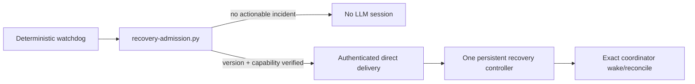

# Pre-Session Recovery Admission — Protocol v3.2.1

Protocol v3.2.1 addresses a live defect in v3.1.1: every recurring recovery `PromptAction` creates a Craft session **before** in-session singleton checks run. On builds retaining Pi harnesses, this caused session/process growth even when controller logic was correct.

## Safe topology



A recurring recovery controller is permanently disabled. The scheduler notifier remains a disabled legacy installation guard and is never armed by direct admission. Production delivery is available only through Craft's authenticated `automations:admissionDeliver` capability when its `automations:admissionCapabilities` response exactly matches the deployment's configured runtime version and runtime commit; every other server remains report-only/fail-closed.

## Admission rules

An incident batch is admitted only when all conditions hold:

1. the kill switch is absent;
2. at least one open incident has an allowed wake action;
3. project HOLD/needs-owner remains project-wide; owner gates are exact-work-unit scoped; cwd/project conflicts are exact-session scoped; preservation-unknown forbids destructive inference but may admit a current-child or external-wait wake solely for verification;
4. the configured persistent controller exists, is live, and has both `agent-role::recovery-controller` and `controller-mode::persistent`;
5. no prior admission is armed, notified, or blocked;
6. the incident fingerprint is outside cooldown;
7. `automation capabilities` (the `automations:admissionCapabilities` response) reports `available: true`, `version: 1`, `deliverChannel: "automations:admissionDeliver"`, and exact configured `runtimeVersion` and `runtimeCommit`; `system:versions` is not a runtime identity source;
8. an explicit workspace ID is configured and the owner-only server token is available from `CRAFT_SERVER_TOKEN` or `CRAFT_SERVER_TOKEN_FILE`.

The supervisor writes mode-0600 atomic prepared state with the incident IDs, evidence fingerprint, controller session, deterministic delivery scope, and cooldown before calling Craft. It never writes session JSONL/databases, creates notifier sessions, enables/mutates a scheduler matcher on the direct path, or kills processes.

## One-shot execution proof

Before the delivery RPC, a durable `prepared` journal is written with a scope derived solely from the deterministic incident fingerprint. The request uses the same workspace, controller, matcher, action, occurrence, key, and message on every replay. If the process crashes before, during, or after the RPC, retrying returns Craft's original receipt through `duplicate`; only `delivered`, `queued`, or `duplicate` with a nonempty `messageId` moves state to `notified`. `busy` returns exit 75 and retains `prepared`. Before delivery, CLI exit/timeout, transport failure, or invalid discovery JSON also returns 75 and retains the exact prepared scope for retry because no delivery occurred. An authenticated capability payload that is absent, unsupported, or mismatches the configured runtime identity enters a hard blocked state; malformed delivery replies remain fail-closed/unknown according to the idempotent delivery path.

The persisted success receipt contains the direct `messageId` and a null `notifierSessionId`. No SchedulerTick prompt, notifier execution history, or notifier cleanup exists on this path.

## Persistent controller and notifier

The direct-delivery target is the one existing persistent controller. Its session manifest and harness proof remain mandatory before delivery. No notifier is created, so no notifier harness registration, session mutation, archive, or reaping is authorized.

The persistent controller applies only ledger-authorized recovery. It does not replace project coordinators or report routine status. Existing controller-harness PID/start-token/command-hash and archive-first preservation guards remain authoritative for any unrelated legacy cleanup.

Before registry validation and incident detection, the watchdog reconciles coordinator liveness from durable session evidence. Only a completed, non-intermediate assistant event newer than the recorded heartbeat may advance the lease of the exact live authoritative coordinator, and only within the existing TTL window. User/child messages, intermediate output, stale old events, HOLD, needs-owner, rotation, archived sessions, and identity mismatch cannot renew ownership. This prevents false stale incidents when a live coordinator omits its model-authored heartbeat command without converting passive session existence into liveness.

When an observed incident condition disappears, the first missing scan writes `clearCandidateAt` and admission pauses for that incident. Only sustained absence for the configured confirmation interval (default five minutes, spanning another watchdog cycle) resolves it and resets the active attempt counter; recurrence before confirmation cancels the candidate and preserves the prior budget. Prior attempts remain in history. A later recurrence after confirmed clear starts a fresh wake-1/wake-2/rotation cycle instead of inheriting earlier exhaustion.

## Observable external waits

CI, auto-merge, deployment, and other external barriers are work, not idle prose. `external-wait.py register --apply` requires an exact authoritative coordinator, a parent-bound live worker/auditor lease, and an active `observable-job.py` receipt. Records contain only non-secret immutable subjects such as run/job IDs and exact head SHAs.

Registration and every transition are serialized by one runtime lock. The record binds the durable job-command hash and the live observer's PID, PPID, process start token, and process-command hash, so PID reuse or command substitution fails closed. The deterministic watchdog reconciles these records before incident detection. A terminal receipt emits `external-wait-terminal`; a missing/mismatched lease, job, process identity, or command emits `external-wait-unobserved`; an exceeded deadline emits `external-wait-deadline`. All three wake the existing coordinator through normal admission. Watched jobs are excluded from the generic `job-exit-unreported` path, so one external transition produces one semantic incident. Clearing requires the exact coordinator, a terminal observer receipt, and non-secret evidence. Because the wait and job are separate files, clear first writes a durable `clearing` journal, then acknowledges the job and finalizes `cleared`; a crash at either boundary is completed deterministically by the next watchdog reconciliation. Active, missing, or deadline-only waits cannot be cleared.

A statement that auto-merge is expected is not evidence that auto-merge was configured. The coordinator must retain responsibility for merge unless an immutable GitHub receipt proves enablement.

`controller-harness.py` retains PID/start-token/command-hash, app, PID-reuse, caller-binding, and tri-state process guards. No app restart/termination, PID guessing, SIGKILL, cwd inference, or private session mutation is permitted.

## Commands

```bash
# Pure observation; creates no session and writes nothing
recovery-admission.py report

# Dry-run admission decision
recovery-admission.py tick --controller-session <persistent-session>

# Production tick; kill switch must be absent. These values have no package defaults.
recovery-admission.py tick --controller-session <persistent-session> \\
  --workspace-id <Craft-workspace-id> --expected-runtime-version <runtimeVersion> \\
  --expected-runtime-commit <runtimeCommit> --apply

# Owner/operator-reviewed recovery from blocked/notified state
recovery-admission.py reset --apply
```

## Activation sequence

1. Install the script and disabled `a321-notifier` template.
2. Keep legacy `a31101` and `a31102` disabled.
3. Keep `self-healing.disabled` present during report-only canaries.
4. Observe at least two real 15-minute intervals with zero new sessions.
5. Create and label exactly one persistent controller.
6. Configure `sessionId`, `workspaceId`, `expectedRuntimeVersion`, `expectedRuntimeCommit`, the trusted `serverUrl`, and the absolute executable `rpcCli` path in `$CRAFT_HOME/runtime/self-healing/persistent-controller.json`. The periodic launcher refuses PATH-based CLI discovery and refuses non-TLS remote WebSocket URLs (`ws://` is accepted only for loopback). Set `CRAFT_SERVER_TOKEN` in the service environment or write an owner-only (mode 0600) token file at `~/.config/craft-agent-headless/server-token`.
7. Remove the kill switch only when authenticated `craft-cli automation capabilities` reports the accepted direct channel and exact configured `runtimeVersion` and `runtimeCommit`. Do not use `craft-cli versions` for this decision and do not infer support from package internals.
8. Run one admitted stale-coordinator canary. Require one direct `messageId`, zero notifier sessions, and no session/process growth over two following intervals. Any busy retry is idempotent; any blocked/capability failure restores hard refusal.

## Retained boundaries

v3.2.1 does not authorize owner-gate/HOLD decisions, merges/deploys, dirty/unpushed cleanup, extra correction/audit cycles, project supervision, or Craft app restart/termination. Delivery Mode v3.2.0 remains authoritative.
