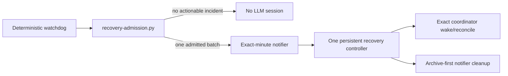

# Pre-Session Recovery Admission — Protocol v3.2.1

Protocol v3.2.1 addresses a live defect in v3.1.1: every recurring recovery `PromptAction` creates a Craft session **before** in-session singleton checks run. On builds retaining Pi harnesses, this caused session/process growth even when controller logic was correct.

## Safe topology



A recurring recovery controller is permanently disabled. The only scheduler prompt is a disabled notifier template. On the current Craft public interface, `recovery-admission.py` **cannot arm it** because Craft exposes no supported pre-fire idempotency claim. This is an intentional production hard refusal, not an operator-togglable flag.

## Admission rules

An incident batch is admitted only when all conditions hold:

1. the kill switch is absent;
2. at least one open incident has an allowed wake action;
3. owner gates, HOLDs, preservation-unknown, cwd/project conflicts, and ambiguous ownership are excluded;
4. the configured persistent controller exists, is live, and has both `agent-role::recovery-controller` and `controller-mode::persistent`;
5. no prior admission is armed, notified, or blocked;
6. the incident fingerprint is outside cooldown;
7. exactly one `a321-notifier` matcher exists and contains exactly one prompt action.

The supervisor writes mode-0600 atomic state with the incident IDs, evidence fingerprint, controller session, scheduled minute, expiry, and history baseline. It never writes session JSONL/databases, discovers private RPC tokens, sends messages, spawns sessions, or kills processes.

## One-shot execution proof

Craft hot-reloads the documented `automations.json` workspace configuration and appends durable execution receipts to `automations-history.jsonl`.

The prepared/armed transaction and receipt reconciler are covered synthetically for future integration. Before enabling the matcher, a durable `prepared` journal is written; incomplete transactions synchronously disable the matcher and block. The kill-switch path acquires the admission lock and disables any prepared/armed matcher.

Once Craft provides a supported pre-fire claim, the next supervisor tick will reconcile:

- **one receipt:** disable the matcher and record the notifier session ID;
- **zero receipts after expiry:** disable and enter `blocked`;
- **more than one receipt:** disable and enter `blocked`;
- **ambiguous/invalid config:** fail closed without arming.

The exact cron includes minute, hour, day, and month in UTC. Even if disable reconciliation is delayed, it cannot match again during the year.

## Persistent controller and notifier

The notifier is infrastructure transport only. Its first action registers its exact harness PID/start-token/command hash with `controller-harness.py`; registration failure stops before delivery. It then sends one admitted fingerprint, its own session ID, and incident-ID set to the one persistent controller, then stops. It must not inspect projects, claim incidents, contact coordinators, or spawn sessions.

Healthy transient bounds permit exactly one active persistent controller plus at most one active or terminal-awaiting-reap notifier. Duplicate controllers, duplicate notifiers, or more than one terminal recovery receipt fail health.

The persistent controller applies only ledger-authorized recovery. It does not replace project coordinators or report routine status. It archives each notifier before exact guarded harness reaping. If archive/preservation/process identity cannot be proven, cleanup fails closed.

`controller-harness.py` retains PID/start-token/command-hash, app, PID-reuse, caller-binding, and tri-state process guards. No app restart/termination, PID guessing, SIGKILL, cwd inference, or private session mutation is permitted.

## Commands

```bash
# Pure observation; creates no session and writes nothing
recovery-admission.py report

# Dry-run admission decision
recovery-admission.py tick --controller-session <persistent-session>

# Production tick; kill switch must be absent
recovery-admission.py tick --controller-session <persistent-session> --apply

# Owner/operator-reviewed recovery from blocked/notified state
recovery-admission.py reset --apply
```

## Activation sequence

1. Install the script and disabled `a321-notifier` template.
2. Keep legacy `a31101` and `a31102` disabled.
3. Keep `self-healing.disabled` present during report-only canaries.
4. Observe at least two real 15-minute intervals with zero new sessions.
5. Create and label exactly one persistent controller.
6. **Current stop:** keep the kill switch present and the PR draft. Production `tick --apply` returns `scheduler-prefire-claim-unsupported`.
7. Upgrade Craft only when a documented pre-fire idempotency claim or supported addressable persistent-session API exists; do not infer support from package internals.
8. Then implement/prove that capability and run one admitted no-op notifier canary.
9. Require exactly one notifier receipt/session, exactly one controller delivery, archive-before-reap, and zero notifier process/receipt residue.
10. Run one exact stale-coordinator wake canary, then two intervals with no session/process growth. Any missed/duplicate execution blocks rollout.

## Retained boundaries

v3.2.1 does not authorize owner-gate/HOLD decisions, merges/deploys, dirty/unpushed cleanup, extra correction/audit cycles, project supervision, or Craft app restart/termination. Delivery Mode v3.2.0 remains authoritative.
