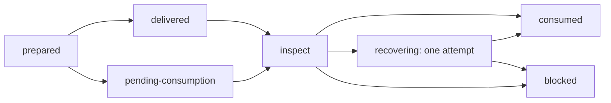

# Consumption-Aware Admission and Coordinator Ticks — Protocol v3.2.2

## Why v3.2.2 exists

On 2026-08-11 the deterministic watchdog and admission LaunchAgent continued to run every five minutes, but the persistent recovery controller did not complete a turn. The UI showed `Musing… 479:38`. Every admission message sent during that period was a mid-stream steer into the same poisoned processing generation. `queued` had been treated as success, and volatile `agePastExpiryMs` changed the admission fingerprint every scan, producing a delivery storm while all coordinator leases expired.

Protocol v3.2.2 removes both failure modes:

- incident identity excludes wall-clock age;
- accepted delivery is not consumption;
- one outstanding envelope is coalesced in place;
- a configured processing deadline leads to one guarded recovery attempt, never silent indefinite pending;
- routine low-risk wakes go directly to the exact authoritative coordinator generation instead of depending on the recovery controller.

## Required runtime capability v2

Protocol accepts only an authenticated `automation capabilities` response with all of the following exact identity fields:

```json
{
  "available": true,
  "version": 2,
  "deliverChannel": "automations:admissionDeliver",
  "inspectChannel": "automations:admissionInspect",
  "recoverChannel": "automations:admissionRecover",
  "runtimeVersion": "<configured exact version>",
  "runtimeCommit": "<configured exact commit>",
  "deliveryStates": ["delivered", "pending-consumption", "consumed", "duplicate", "busy", "blocked"],
  "targetKinds": ["controller", "coordinator"],
  "minimumRecoveryAgeMs": 60000
}
```

The array order is irrelevant; the sets must match. The configured Protocol deadline must be at least the runtime minimum. Capability v1, absent channels, unknown states, extra/absent target kinds, a runtime identity mismatch, and malformed JSON all fail closed. `system:versions` is never an admission identity source.

### Exact CLI adapter

The configured absolute `craft-cli` is invoked with global `--json`. These command names and flags are the only supported adapter surface:

```text
automation deliver
  --workspace <workspaceId> --session <sessionId>
  --matcher <matcherId> --action <actionId>
  --occurrence <occurrenceId> --key <idempotencyKey>
  --target-kind <controller|coordinator>
  --target-id <same exact sessionId>
  --target-generation <opaque exact Protocol generation>
  <message>

automation inspect
  --workspace <workspaceId> --session <sessionId>
  --matcher <matcherId> --action <actionId>
  --occurrence <occurrenceId> --key <idempotencyKey>

automation recover
  --workspace <workspaceId> --session <sessionId>
  --matcher <matcherId> --action <actionId>
  --occurrence <occurrenceId> --key <idempotencyKey>
  --target-kind <controller|coordinator>
  --target-id <same exact sessionId>
  --target-generation <opaque exact Protocol generation>
  --message-id <outstanding messageId>
  --runtime-version <configured exact version>
  --runtime-commit <configured exact commit>
  --processing-generation <exact integer CAS>
  --minimum-processing-age-ms <configured deadline>
```

For coordinators, `targetGeneration` is the exact authoritative registry generation. For the persistent controller it is `session:<sessionId>`; changing the controller session therefore changes the target generation. The workspace listing, target manifest root, and configured workspace root must resolve to the same path.

### Response contract

Delivery returns `{status,messageId?,reason?,receipt?}`. Protocol accepts only `delivered`, `pending-consumption`, `consumed`, or `duplicate` with one nonempty original `messageId` and a receipt whose scope, session, target kind/ID/generation, occurrence, and idempotency key exactly match. `busy` is an idempotent exit-75 retry with the same prepared scope. `blocked`, plain legacy `queued`, unknown status, changed message ID, or receipt ambiguity fails closed.

Inspection returns:

```json
{
  "status": "missing|delivered|pending-consumption|consumed|blocked",
  "receipt": null,
  "session": {
    "isProcessing": false,
    "processingGeneration": null,
    "processingStartedAt": null,
    "processingAgeMs": null,
    "queueDepth": 0,
    "lastFinalMessageId": null,
    "lastFinalMessageAt": null,
    "lastErrorMessageId": null,
    "lastErrorMessageAt": null
  }
}
```

For an outstanding cycle, `receipt` must be non-null and exactly match the durable delivery receipt. `missing`, `blocked`, identity mismatch, a processing target without an integer generation/start time, or an idle target retaining an active generation fails closed.

Recovery adds the exact message, target, runtime, and processing-generation CAS plus the minimum age. Only `recovered` or already-`consumed` with matching message/generation is accepted. Runtime `blocked`, a second attempted correction, or any mismatch puts that target cycle into durable `blocked`. This is a recovery-specific primitive; Protocol exposes no generic remote kill operation.

## Admission state machine

Each target has an owner-only atomic schema-v3 state file. The controller uses `runtime/self-healing/admission.json`; coordinators use one project-keyed file under `runtime/self-healing/coordinator-ticks/`.



Rules:

1. `prepared` is written before external mutation. Crash retry keeps the exact occurrence/key/message. An existing unreadable state file is preserved byte-for-byte and blocks that target; Protocol never overwrites unknown state and risks duplicating its receipt. Unreadable coordinator registries, incident records, or owner gates block target selection because uniqueness, preservation, and gate clearance cannot be proved.
2. `delivered`, `pending-consumption`, and `duplicate` are outstanding, not completion.
3. Every later tick inspects the exact receipt. There is no cooldown rearm while outstanding. Unknown-outcome retries adopt the runtime receipt's original `deliveredAt`; retry time can never postpone the processing/idle deadline.
4. New meaningful incidents for the same target are delivered with the same scope; runtime must replace/coalesce the envelope and retain one message ID and queue entry.
5. An incident disappearing locally does not prove consumption. Inspection continues until the runtime receipt is consumed or blocked.
6. Only runtime `consumed`, backed by a completed newer target turn, ends the cycle.
7. If `isProcessing` exceeds `CRAFT_ADMISSION_RECOVERY_MIN_AGE_SECONDS` (default 1,800 seconds), Protocol calls guarded recovery once. Any later stuck processing generation in that cycle blocks without a second recovery. If an unconsumed envelope remains idle/not-processing through the deadline, it also blocks because there is no exact processing-generation CAS to recover. The 479-minute production failure therefore cannot remain silently pending.
8. Schema-v2 `notified` state cannot be inferred safely and requires owner-reviewed reset while the kill switch remains present.

## Stable incident identity

`coordinator-lease-stale` retains `agePastExpiryMs` only as human-facing diagnostics. Its `evidenceFingerprint` binds immutable condition identity:

- coordinator session (through stable incident ID);
- coordinator registry generation;
- `lastHeartbeatAt`;
- `leaseExpiresAt`.

Admission fingerprints contain sorted incident IDs, stable evidence fingerprints, and `conditionRevision`. The occurrence/idempotency digest binds exact target identity plus the cycle's initial stable fingerprint; `preparedAt` and every other wall-clock value are excluded. Coalescing retains that original scope while updating the envelope. `lastSeenAt`, current time, elapsed age, and cooldown clocks are excluded. Confirmed clear followed by recurrence increments `conditionRevision`, creating a new bounded recovery cycle even when immutable evidence happens to repeat.

## Direct coordinator tick lane

The following only are eligible for direct delivery:

- a deterministic `coordinator-tick-due` candidate at half the current authority TTL, bound to session, generation, `lastHeartbeatAt`, and `leaseExpiresAt`;
- `coordinator-lease-stale` whose incident session and evidence generation exactly match the authoritative registry;
- a current `activeChildren` `terminal-handoff-unconsumed` whose recorded coordinator exactly matches that registry;
- `external-wait-terminal` whose recorded coordinator exactly matches that registry.

The target must be one live, unarchived `agent-role::coordinator` in authoritative registry state and that session ID must own exactly one authoritative/rotating/HOLD/needs-owner project globally. Ambiguous cross-project ownership receives no scheduled direct tick. One project state file permits only one outstanding tick for that exact session/generation. A generation change while outstanding blocks rather than redirecting the old receipt. Manifest workspace roots are checked per target before global server/workspace discovery: an invalid, misbound, or stuck recovery controller blocks only its own complex cycle and cannot short-circuit valid direct coordinator targets.

Direct tick text authorizes only registry/child/wait reconciliation, continuation of executable lanes, and renewal through a completed coordinator turn. HOLD/needs-owner, exact owner gates, preservation ambiguity, mapping/cwd conflicts, rotation, archive/reap, provider failure, unobserved/deadline external waits, and destructive decisions remain controller-bound or fail closed. In particular, a current handoff or terminal external wait paired with `preservation-unknown` is routed to the complex controller, never the direct lane. Invalid direct identity falls back to the complex recovery batch; it is never guessed or retargeted.

The five-minute admission service evaluates the half-TTL boundary for the default one-hour authority lease without a separate session-creating scheduler action. Consumption suppresses that same stable tick identity until a completed coordinator turn advances heartbeat/expiry; the next half-TTL window then has a new meaningful fingerprint.

## Installation and activation

The installer remains dry-run by default. `--apply` installs scripts/tests/docs and a permanently disabled `a322-admission` scheduler guard, disables `a321-notifier`, `a31101`, and `a31102`, restores `self-healing.disabled`, and does **not** enable production admission.

Before removing the kill switch, configure the persistent controller file with exact `sessionId`, `workspaceId`, `expectedRuntimeVersion`, `expectedRuntimeCommit`, trusted `serverUrl`, and absolute executable `rpcCli`; provide an environment token or owner-only token file. Capability-v2 runtime and Protocol must be installed as one reviewed candidate. Legacy state must be reset explicitly. No production installation, launchctl mutation, or app/process recovery is performed by the package tests.

## Retained safety boundaries

Protocol v3.2.2 does not authorize owner decisions, HOLD bypass, merge/deploy, dirty or unpushed cleanup, project reporting to the architecture session, generic session cancellation, Craft app restart/termination, or a second autonomous stuck-turn correction. Delivery Mode v3.2.0 and all preservation/split-brain invariants remain authoritative.
