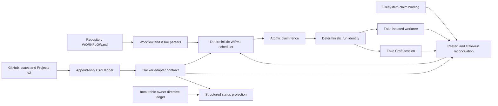

# Craft Protocol v4.2 Scheduler and GitHub Adapter

This directory is a **parallel v4 package**. It does not wrap or modify the v3 runtime, Fleet, launchd, live Craft Agents, or production state. GitHub access is isolated behind an injected transport; tests use an in-memory transport and never mutate live GitHub.

## Architecture



- `WORKFLOW.md` plus `workflow.schema.json` define the versioned repository policy. The parser enforces WIP=1, bounded retry values, an explicit fake or GitHub tracker, and allowlisted Codex/Pi profiles.
- The issue parser normalizes the Symphony issue shape and merges the fenced issue work contract with repository defaults. Missing goals, acceptance, non-goals, risk, authority, model, or verification budget fail closed before a claim.
- `TrackerAdapter.tryClaim` is the compare-and-set boundary. The fake performs an in-process CAS; the GitHub adapter first elects one project-wide lease on a shared provider comment ledger, then commits the per-issue event. Labels/Project fields remain projections.
- A durable GitHub claim binds issue, attempt, fence, exact session/worktree identity, base SHA, model, timestamps, and expiry. Stale fences and concurrent losing comments cannot advance state.
- Project items and field values are fully paginated and normalized by exact node/field/option IDs. Native blockers, contract dependencies, Gate IDs, and provider PR/merge evidence require exact branch names and head/base OIDs; missing or ambiguous truth fails closed.
- Startup reconciliation combines the reconstructed GitHub ledger with a root-confined filesystem claim-binding reader. Missing running workspaces, mismatched bindings, edited/gapped ledgers, duplicate fields, or unprovable preservation state become `preservation-unknown`.
- Session and worktree identities are derived from stable issue/attempt inputs. Adapters implement idempotent `ensure`, so a crash can resume the same identity but cannot create a second identity for one attempt.
- Retry and stale decisions use only state, timestamps, failure class, and configured numeric bounds. Only `transient` and `runtime` failures retry.
- Agent success or silence never completes an issue. Durable lifecycle/evidence transitions drive the compact status projection.

## Lifecycle

Normal flow:

`ready → claimed → running → pr-open → review/owner-gate → merged/deployed → done`

Exceptional states:

`blocked`, `retry-wait`, `failed`, `cancelled`, `preservation-unknown`

Transitions are an explicit table in `src/domain.ts`; the scheduler and adapters do not ask an LLM to choose claims, retries, reconciliation outcomes, or verification actions.

## Safety boundary

The package still creates no real worktrees or Craft sessions. `GhCliTransport` is an inert authenticated boundary until explicitly invoked; all adapter tests inject a memory transport. GitHub event comments are the authoritative append-only CAS log, while lifecycle labels, Project Status, and Gate fields are deterministic projections. Filesystem reconciliation is read-only and never cleans or repairs ambiguous workspaces.

Owner directives are append-only, stored verbatim, and include acknowledgement timing. Risk policy permits no independent reviewer for low risk and caps medium/high review and correction counts to prevent audit loops.

## Focused verification

```bash
cd v4
bun install --frozen-lockfile
bun run typecheck
bun test
```

The seventeen focused tests cover the seven v4.1 scheduler invariants plus GitHub pagination/field normalization, dependency mapping, same-issue and cross-issue concurrent claims, stale claims, forged PR evidence rejection, exact PR/merge evidence, claimless-active fail-closed behavior, restart reconstruction, exact Gate IDs, preservation-unknown behavior, and one injected adapter integration smoke.
