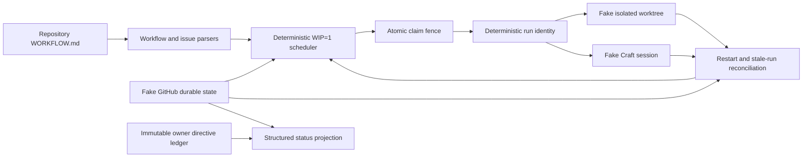

# Craft Protocol v4.1 Scheduler Core

This directory is a **parallel, simulator-only v4 package**. It does not wrap or modify the v3 runtime, Fleet, launchd, live GitHub, live Craft Agents, or production state.

## Architecture



- `WORKFLOW.md` plus `workflow.schema.json` define the versioned repository policy. The parser enforces WIP=1, bounded retry values, a fake tracker, and allowlisted Codex/Pi profiles.
- The issue parser normalizes the Symphony issue shape and merges the fenced issue work contract with repository defaults. Missing goals, acceptance, non-goals, risk, authority, model, or verification budget fail closed before a claim.
- `FakeGitHubAdapter.tryClaim` is the single atomic compare-and-set boundary. A claim binds issue, attempt, fence, exact session/worktree identity, base SHA, model, timestamps, and expiry.
- Session and worktree identities are derived from stable issue/attempt inputs. Adapters implement idempotent `ensure`, so a crash can resume the same identity but cannot create a second identity for one attempt.
- Retry and stale decisions use only state, timestamps, failure class, and configured numeric bounds. Only `transient` and `runtime` failures retry.
- Agent success or silence never completes an issue. Durable lifecycle/evidence transitions drive the compact status projection.

## Lifecycle

Normal flow:

`ready → claimed → running → pr-open → review/owner-gate → merged/deployed → done`

Exceptional states:

`blocked`, `retry-wait`, `failed`, `cancelled`, `preservation-unknown`

Transitions are an explicit table in `src/domain.ts`; the scheduler and adapters do not ask an LLM to choose claims, retries, reconciliation outcomes, or verification actions.

## Safety boundary

This increment intentionally uses fakes. It creates no real worktrees or Craft sessions and performs no GitHub writes. The workspace abstraction validates that derived paths remain below the configured root but does not yet inspect dirty, shared, or unpushed real repositories. The fake CAS is atomic within one JavaScript process; a future GitHub adapter must provide an equivalent provider-backed compare-and-set fence.

Owner directives are append-only, stored verbatim, and include acknowledgement timing. Risk policy permits no independent reviewer for low risk and caps medium/high review and correction counts to prevent audit loops.

## Focused verification

```bash
cd v4
bun install --frozen-lockfile
bun run typecheck
bun test
```

The seven tests cover exactly-once concurrent claims, duplicate identity prevention, restart recovery, stale-run bounded retry, directive immutability and exact gates, risk budgets, and one crash/restart simulator smoke.
