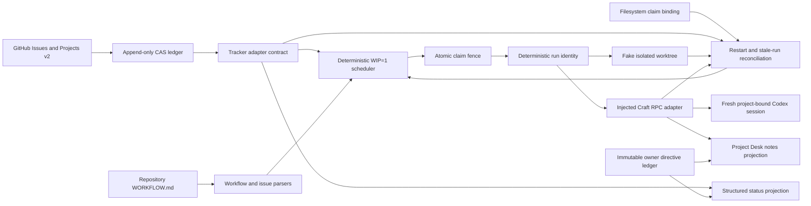

# Craft Protocol v4.3 Scheduler, GitHub, and Craft Adapters

This directory is a **parallel v4 package**. It does not wrap or modify the v3 runtime, Fleet, launchd, live Craft Agents, or production state. GitHub and Craft access are isolated behind injected transports; tests use in-memory transports and never mutate live GitHub or Craft.

## Architecture



- `WORKFLOW.md` plus `workflow.schema.json` define the versioned repository policy. The parser enforces WIP=1, bounded retry values, an explicit fake or GitHub tracker, and allowlisted Codex/Pi profiles.
- The issue parser normalizes the Symphony issue shape and merges the fenced issue work contract with repository defaults. Missing goals, acceptance, non-goals, risk, authority, model, or verification budget fail closed before a claim.
- `TrackerAdapter.tryClaim` is the compare-and-set boundary. The fake performs an in-process CAS; the GitHub adapter first elects one project-wide lease on a shared provider comment ledger, then commits the per-issue event. Labels/Project fields remain projections.
- A durable GitHub claim binds issue, attempt, fence, exact session/worktree identity, base SHA, model, timestamps, and expiry. Stale fences and concurrent losing comments cannot advance state.
- Project items and field values are fully paginated and normalized by exact node/field/option IDs. Native blockers, contract dependencies, Gate IDs, and provider PR/merge evidence require exact branch names and head/base OIDs; missing or ambiguous truth fails closed.
- Startup reconciliation combines the reconstructed GitHub ledger with a root-confined filesystem claim-binding reader. Missing running workspaces, mismatched bindings, edited/gapped ledgers, duplicate fields, or unprovable preservation state become `preservation-unknown`.
- Session and worktree identities are derived from stable issue/attempt inputs. Adapters implement idempotent `ensure`, so a crash can resume the same identity but cannot create a second identity for one attempt.
- Retry and stale decisions use only state, timestamps, failure class, and configured numeric bounds. Only `transient` and `runtime` failures retry.
- Agent success or silence never completes an issue. Durable lifecycle/evidence transitions drive the compact status projection.
- The Craft adapter admits only exact `chatgpt-plus` plus allowlisted `pi/gpt-*` profiles. It creates unbranched project-bound sessions with exact worktree/model/connection readback and canonical valued issue/run labels.
- A configured CLI transport requires an explicit absolute executable path and exact CLI path/version plus server ID/version. It never assumes a packaged `current/bin/craft-cli` path and fails closed before mutation when identity is absent or ambiguous.
- Restart discovery uses the exact canonical run label. One exact matching session is idempotently resumed; duplicate or cross-issue bindings are refused.
- A settled turn requires the persisted execution prompt, stopped processing, and Craft's authoritative non-empty final assistant message after that prompt. Low-level `agent_end`/`complete` without a response is a failure outcome, not settlement.
- Turn, context-token, RPC, and cancellation deadlines are numeric and bounded. Replacement attempts are fresh sessions; they receive only the issue contract, immutable owner directives, repository instructions, and a bounded compact status handoff—never a prior transcript.
- Direct owner directives must match one exact user message in the configured project-bound owner desk. Their immutable acknowledgement evidence is projected to desk notes within 60 seconds. Gate commands retain exact immutable-ID parsing.
- Project Desk projection is compact metadata only: objective, lifecycle, material links, blocker/next point, exact gate command, active run, context usage, and latest acknowledgement. It contains no execution transcript.

## Lifecycle

Normal flow:

`ready → claimed → running → pr-open → review/owner-gate → merged/deployed → done`

Exceptional states:

`blocked`, `retry-wait`, `failed`, `cancelled`, `preservation-unknown`

Transitions are an explicit table in `src/domain.ts`; the scheduler and adapters do not ask an LLM to choose claims, retries, reconciliation outcomes, or verification actions.

## Safety boundary

The package creates no real worktrees or Craft sessions unless an application explicitly injects and validates live transports. `GhCliTransport` and `CraftCliRpcTransport` are inert boundaries until explicitly invoked; all adapter tests inject memory transports. GitHub event comments are the authoritative append-only CAS log, while lifecycle labels, Project Status, Gate fields, and Craft Project Desk notes are deterministic projections. Filesystem reconciliation is read-only and never cleans or repairs ambiguous workspaces.

Owner directives are append-only, stored verbatim, bound to exact direct-owner messages, and include acknowledgement timing/evidence. Risk policy permits no independent reviewer for low risk and caps medium/high review and correction counts to prevent audit loops.

## Focused verification

```bash
cd v4
bun install --frozen-lockfile
bun run typecheck
bun test tests/scheduler.test.ts tests/github-adapter.test.ts tests/craft-adapter.test.ts
```

The focused suites cover the seven v4.1 scheduler invariants; GitHub pagination/field normalization, dependency mapping, same-issue and cross-issue claims, stale claims, exact PR/merge evidence, Gate IDs, and startup reconciliation; plus Craft CLI/runtime identity, Codex-only admission, exact project/model/connection/worktree binding, canonical-label duplicate refusal, 60-second direct-owner acknowledgement, true settlement versus response-less completion, fresh replacement without transcript inheritance, exact gates, deadlines, Project Desk projection, and one in-memory Craft adapter integration smoke.
